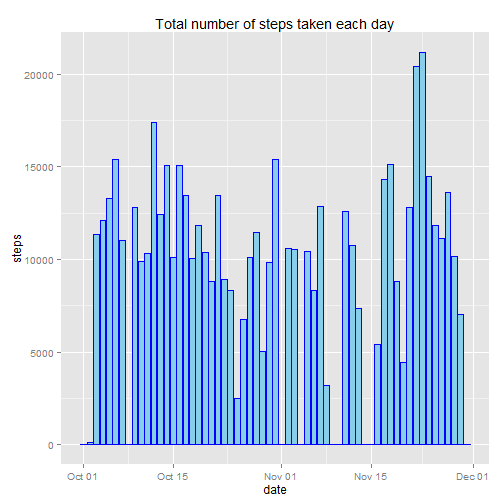
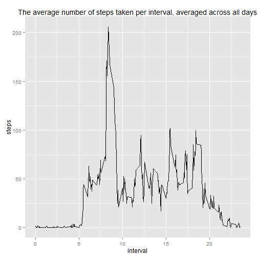

##  Introduction
This report is for the [Coursera John Hopkins Reproducible Research online course](https://www.coursera.org/#course/repdata) Assignment 1

It is now possible to collect a large amount of data about personal movement using activity monitoring devices such as a [Fitbit](http://www.fitbit.com/), [Nike Fuelband](http://www.nike.com/us/en_us/c/nikeplus-fuelband), or [Jawbone Up](https://jawbone.com/up). These type of devices are part of the "quantified self" movement - a group of enthusiasts who take measurements about themselves regularly to improve their health, to find patterns in their behavior, or because they are tech geeks. But these data remain under-utilized both because the raw data are hard to obtain and there is a lack of statistical methods and software for processing and interpreting the data.

This assignment makes use of data from a personal activity monitoring device. This device collects data at 5 minute intervals through out the day. The data consists of two months of data from an anonymous individual collected during the months of October and November, 2012 and include the number of steps taken in 5 minute intervals each day.  


##  The Data

The dataset for this report was downloaded from (https://d396qusza40orc.cloudfront.net/repdata%2Fdata%2Factivity.zip) on 8 November 2014.

The variables included in this dataset are:  
*steps*: Number of steps taking in a 5-minute interval (missing values are coded as NA)  
*date*: The date on which the measurement was taken in YYYY-MM-DD format  
*interval*: Identifier for the 5-minute interval in which measurement was taken  

The dataset is stored in a comma-separated-value (CSV) file and there are a total of 17,568 observations in this dataset.  


##  **Key findings of the data analysis with reproducible code**
  
###  Loading and preprocessing the data

```r
#url <- "https://d396qusza40orc.cloudfront.net/repdata%2Fdata%2Factivity.zip"
#temp <- tempfile()
#download.file(url, temp)
#activity <- tbl_df(read.csv(unz(temp, "activity.csv")))
#unlink(temp)
suppressMessages(library(dplyr))
activity <- tbl_df(read.csv("~/R/workspace/reproducible_research/xactivity.csv")) %>%
  mutate(date = as.Date(date, "%Y-%m-%d"))
```
  
###  What is mean total number of steps taken per day?

```r
daily_steps <- activity %>% 
  group_by(date) %>% 
  summarise(total_steps = sum(steps, na.rm = TRUE))

suppressMessages(library(ggplot2))
g <- ggplot(data=daily_steps, aes(x=date, y=total_steps)) + 
  geom_bar(stat="identity", colour = "blue", fill="sky blue") + 
  labs(y = "steps") + 
  labs(title = "Total number of steps taken each day") 

plot(g)
```

 

The mean and median total number of steps taken per day is 10766.19 and 10765 respectively.

```r
daily_steps %>% 
  filter(total_steps > 0) %>% 
  summarise(mean = mean(total_steps), median = median(total_steps))
```

```
## Source: local data frame [1 x 2]
## 
##       mean median
## 1 10766.19  10765
```

###  What is the average daily activity pattern?

```r
daily_activity <- activity %>% 
  filter(steps >= 0) %>% 
  group_by(interval) %>% 
  summarise(mean = mean(steps)) 

             
q <- ggplot(daily_activity, aes(x=interval/100, y=mean)) +
  geom_line() +
  labs(y = "steps") + 
  labs(x = "interval") +
  labs(title = "The average number of steps taken per interval, averaged across all days") 


plot(q)
```

 

The **835** 5-minute interval, on average across all the days in the dataset, contains the maximum number of steps.


```r
daily_activity %>% 
  arrange(desc(mean)) %>% 
  slice(1) %>% 
  select(interval)
```

```
## Source: local data frame [1 x 1]
## 
##   interval
## 1      835
```

